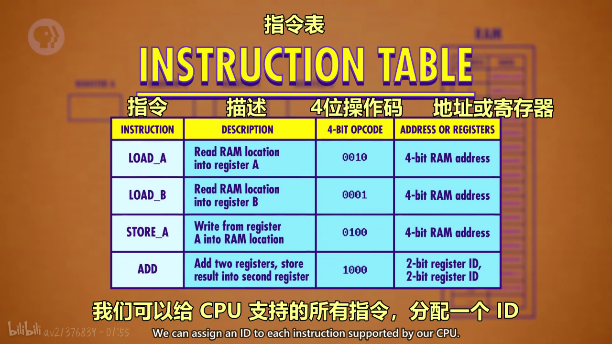
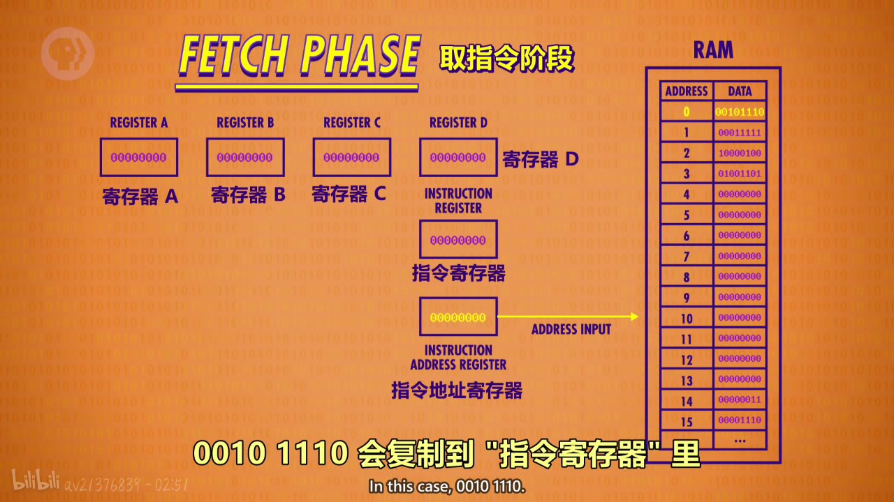
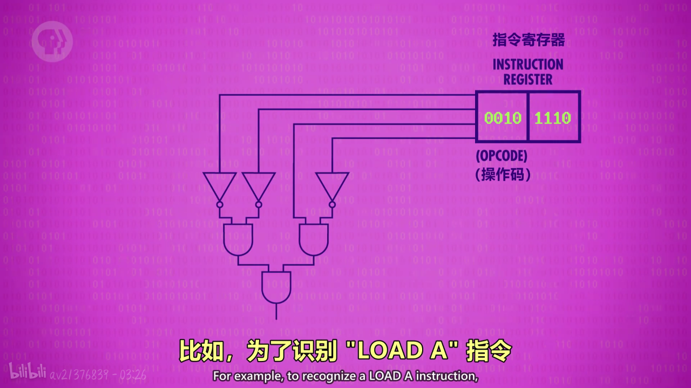
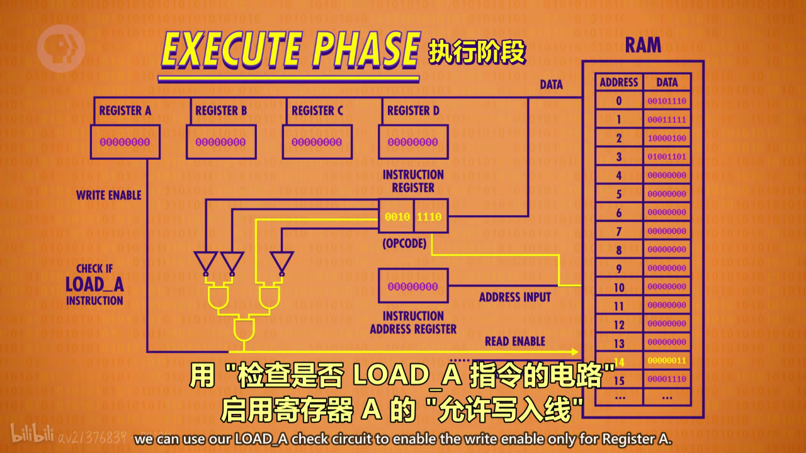
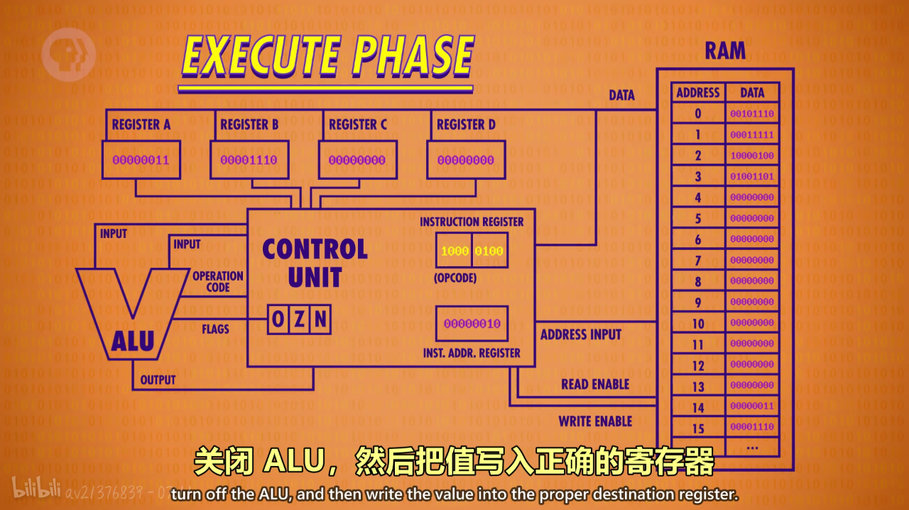
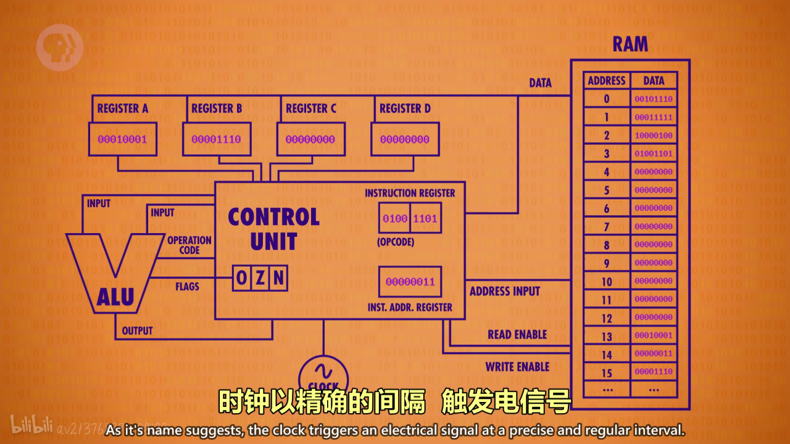

#### 本集要点

* 中央处理单元是计算机的心脏，简称“CPU”
> CPU负责执行程序，如office，chrome...
* 程序由一个个操作组成，这些操作称为**指令**
> 指令告诉计算机要做什么
* 指令地址寄存器是一个负责**追踪程序运行**到哪里了的寄存器
* 指令寄存器是一个**存当前指令**的寄存器

##### 指令表

##### 取指令阶段

> 首先指令地址寄存器会连接到内存，应为刚开始指令地址寄存器积存的地址是00000000，所以会读取内存0位置的指令，然后内存会将0位置的数据（DATA）复制到指令寄存器

##### 解码阶段
* 负责弄清是什么指令

> 0位置的指令是00101110，前四位是LOAD A指令，表示将内存的值放入寄存器A，后四位表示内存地址，转换成十进制是14，接下来指令由控制单元解码.解码器会通过左边的电路识别是不是LOAD A的指令

##### 执行阶段

> 将寄存器（REGISTER)与内存连接起来，接下用解码电路的输出打开内存的允许读取线1将地址14传过去，然后读取14号位置的00000011转换成十进制的3，然后再用解码电路的输出打开寄存器A的允许写入线将值写入，指令完成后关闭电路，同时将指令地址寄存器的00000000加一，变成00000001，然后继续读取下一条指令
>不同的指令由不同的逻辑电路解码，这些逻辑电路会配置CPU内的原件来进行对应的操作

>接下来假将整个解码器电路，指令地址寄存器指令寄存器封装起来组成一个控制单元（CONTROL UNIT)，假设读取到了内存2地址中10000100，1000表示将寄存器的值相加，0100前两位01表示寄存器B，00表示寄存器A，所以连起来应该是将寄存器B的值加到寄存器A中。所以为了相加我们配置一个ALU电路，然后启用寄存器B作为ALU的第一个输入同时启用寄存器A作为另一个输入，然后控制单元会将ADD操作码传递给ALU告诉他应该干什么，ALU执行完后结果不能直接存到寄存器A中，应为这样的话寄存器A中的值会不停与ALU中的值相加，所以当ALU执行完操作后会将结果存到控制单元的寄存器中，然后关闭ALU，把结果写入到寄存器A中

>实际上有一个时钟（CLOCK）来管理CPU的节奏，他会按一定节奏出发电信号，控制单元会用这个信号推进CPU内部的操作。但是这个节奏不能太快，应为电信号传输需要时间，CPU“取指令→解码→执行“的速度叫**时钟速度**，单位是赫兹。一赫兹代表一个周期

>CPU通过数据线（DATA），地址线（ADDRESS INPUT),允许读写线(READ/WRITE ENABLE)与内存进行通信

* 处理器按需求加快或减慢时钟速度称为**动态调整频率**
> 第一个单芯片 CPU 是 "英特尔 4004"，1971 年发布的 4 位CPU。它的时钟速度达到了 740 千赫兹 - 每秒 74 万次

